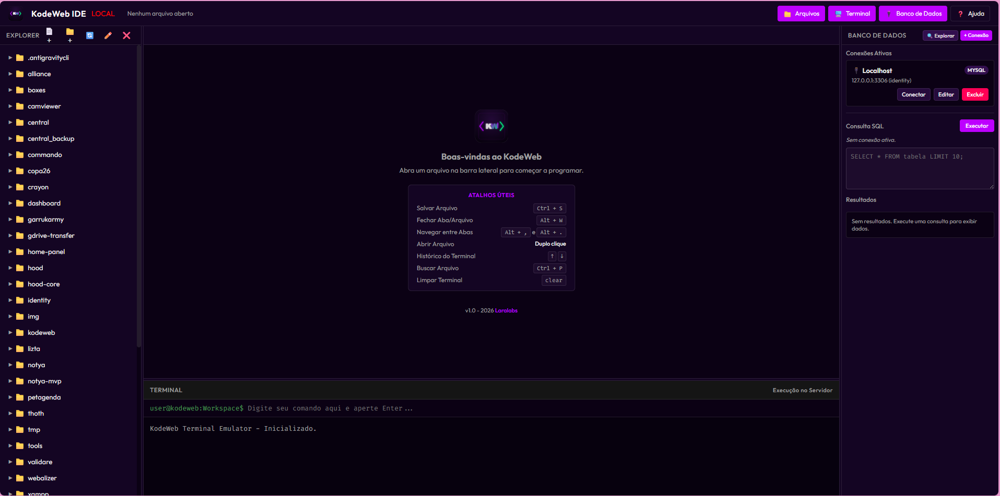

# KodeWeb IDE 💻

**KodeWeb** é uma IDE leve e moderna baseada em PHP e JavaScript, projetada para ser hospedada diretamente em um servidor web. Ela permite gerenciar, criar e editar os arquivos do servidor em tempo real, além de incluir um emulador de terminal interativo e um cliente de banco de dados com credenciais criptografadas.



---

## 🚀 Funcionalidades Principais

*   **Editor de Código Ace**: Integrado via CDN com tema Darcula, autocomplete inteligente e suporte a realce de sintaxe para PHP, JS, CSS, HTML, JSON, SQL, MD, XML, YAML, Apache Configs, entre outros.
*   **Gerenciador de Arquivos sob Demanda**: Árvore de arquivos dinâmica carregada sob demanda para máxima performance. Suporta operações de criação (arquivo/pasta), renomeação, exclusão e edição.
*   **Workspace Abas Multitarefa**: Alterne de forma transparente entre vários arquivos abertos, com suporte a atalhos de salvamento (`Ctrl + S` / `Cmd + S`) e detecção de arquivos com alterações pendentes (dirty states).
*   **Terminal de Comandos Emulado**: Execute comandos shell diretamente no servidor. O sistema rastreia e persiste automaticamente o diretório de trabalho atual (`CWD`) por meio de sessões de comandos, permitindo que você navegue pelo servidor com o comando `cd` padrão. Também inclui histórico de comandos (setas Para Cima/Para Baixo).
*   **Painel de Banco de Dados Criptografado**:
    *   Cadastre e salve conexões com bancos **MySQL**, **PostgreSQL** e **SQLite**.
    *   As credenciais de conexões são armazenadas no servidor de forma criptografada usando algoritmo simétrico **AES-256-CBC**.
    *   Permite executar consultas SQL e visualizar os resultados em uma tabela interativa responsiva diretamente no painel lateral.
*   **Layout Adaptável e Redimensionável**: Esconda ou exiba os painéis (Arquivos, Banco de Dados, Terminal) com botões rápidos na barra de topo e controle o tamanho dos painéis arrastando as bordas.

---

## 🛠️ Requisitos do Sistema

1.  **Servidor Web**: Apache (recomendado, com `mod_rewrite` e suporte a arquivos `.htaccess`) ou Nginx.
2.  **PHP**: Versão 7.4 ou superior (Totalmente compatível com PHP 8.x).
3.  **Extensões do PHP**:
    *   `openssl` (necessária para criptografia das credenciais).
    *   `pdo` e drivers específicos (ex: `pdo_mysql`, `pdo_pgsql`, `pdo_sqlite`) para conexões com bancos de dados.
    *   Habilitação da função `shell_exec` (para funcionamento do terminal).

---

## 📦 Instalação e Configuração

### 1. Clonar ou Fazer Upload
Mova a pasta `kodeweb` inteira para a raiz do seu servidor web (por exemplo, `/var/www/html/kodeweb` ou `/srv/http/kodeweb`).

### 2. Configurar Segurança Básica (Autenticação htaccess)
A IDE vem configurada com segurança via `.htaccess` e um arquivo `.htpasswd` para proteger contra acessos não autorizados.

*   **Credenciais Padrão**:
    *   **Usuário**: `admin`
    *   **Senha**: `admin`

Para alterar a senha padrão ou cadastrar um novo usuário pelo terminal, execute o seguinte comando no diretório da IDE:
```bash
htpasswd -b .htpasswd username password
```

### 3. Permissões de Pastas e Arquivos
Para que a IDE possa ler e salvar alterações, o usuário do servidor web (ex: `www-data` ou `http`) deve possuir permissão de escrita nas seguintes pastas:
*   `kodeweb/` (necessário para criar a chave de segurança `.key` no primeiro acesso e salvar conexões).
*   `kodeweb/connections/` (onde são armazenados os arquivos de conexão criptografados).
*   O diretório pai/workspace que deseja editar no servidor.

No Linux, você pode ajustar as permissões rapidamente rodando:
```bash
chown -R www-data:www-data /caminho/para/kodeweb
chmod -R 755 /caminho/para/kodeweb
```
As conexões de banco de dados criadas são protegidas por um `.htaccess` dedicado dentro da pasta `connections/` contendo `Require all denied`, bloqueando qualquer leitura direta via navegador.

---

## 🎹 Atalhos Úteis

*   **Salvar arquivo**: `Ctrl + S` (Windows/Linux) ou `Cmd + S` (macOS).
*   **Fechar aba/arquivo**: `Alt + W` (Windows/Linux) ou `Option + W` (macOS). *(Também aceita `Ctrl + W` / `Cmd + W` quando executado em modo PWA).*
*   **Alternar pastas na árvore**: Duplo clique abre arquivos, clique simples em uma pasta expande/recolhe.
*   **Navegar no histórico do terminal**: Seta `Para Cima` (Up Arrow) e `Para Baixo` (Down Arrow) no input de comandos.
*   **Limpar terminal**: Digite `clear` ou `cls` e aperte Enter.
